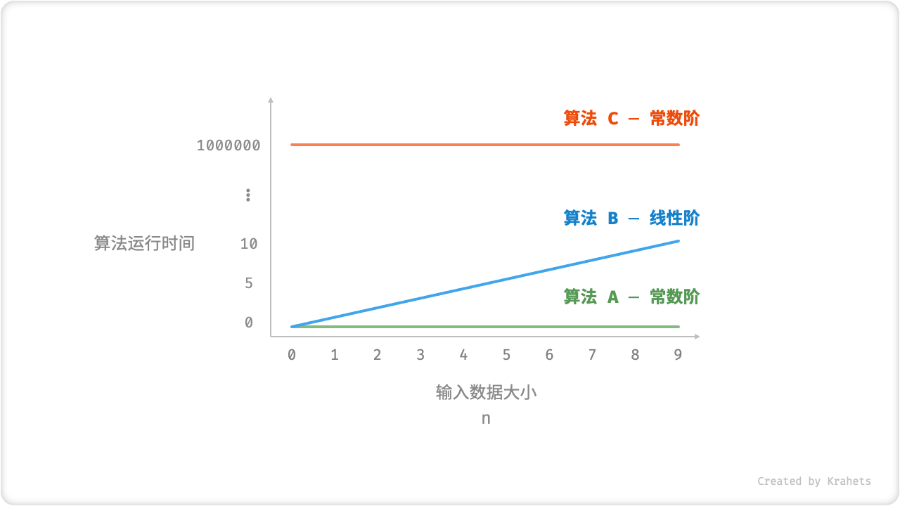
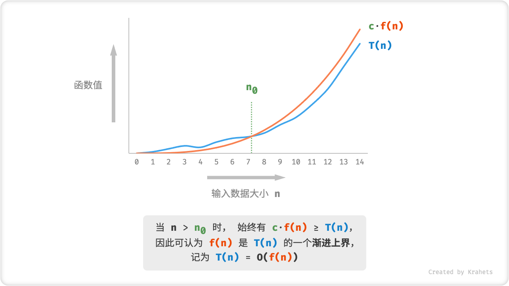
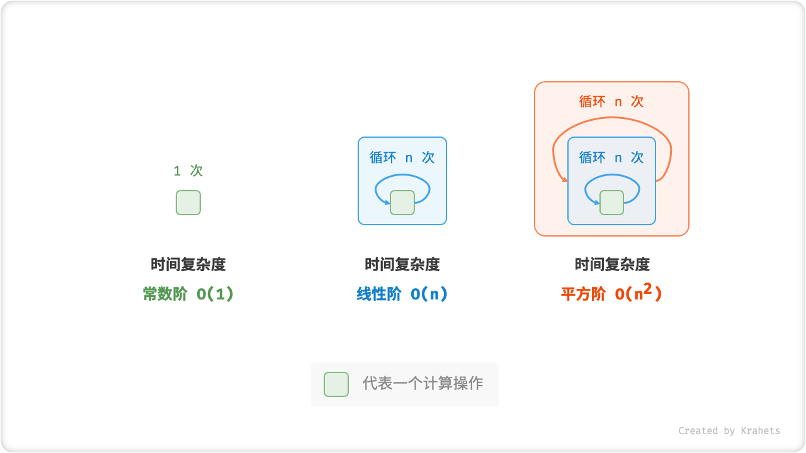
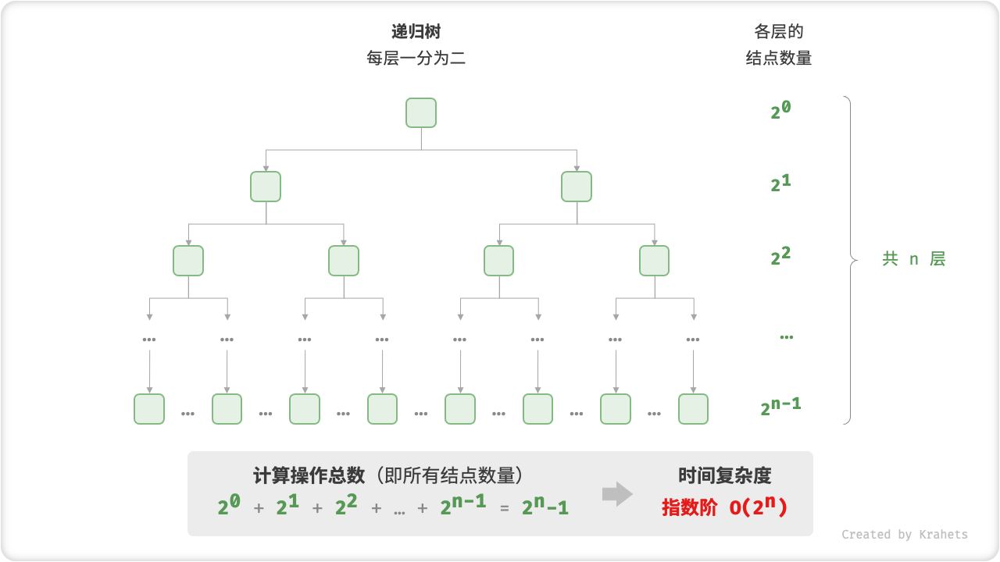
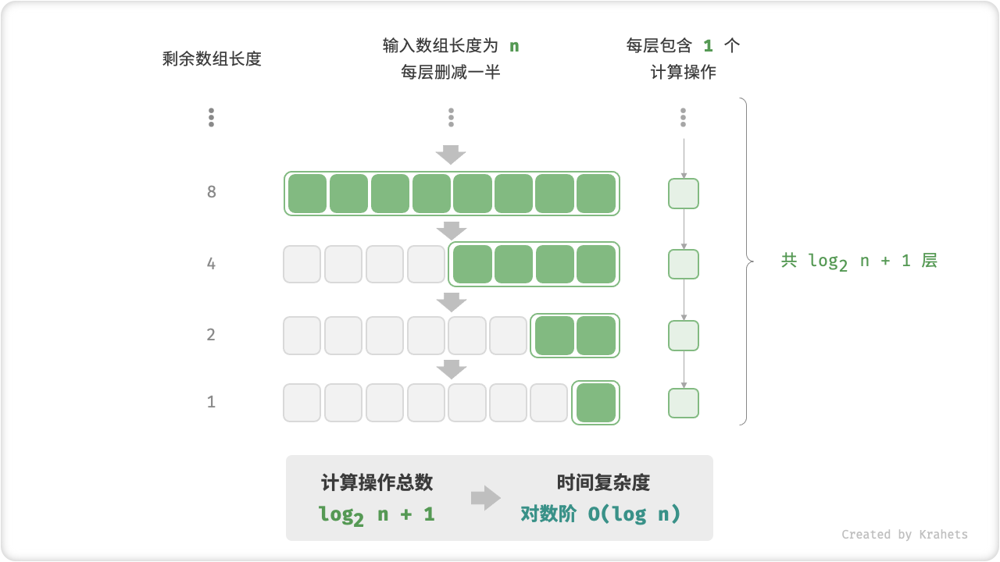
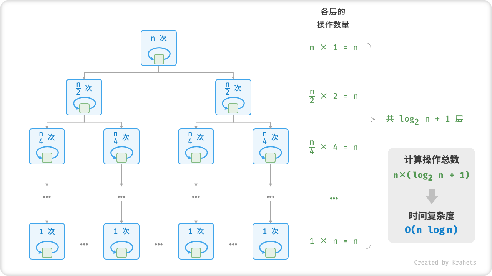
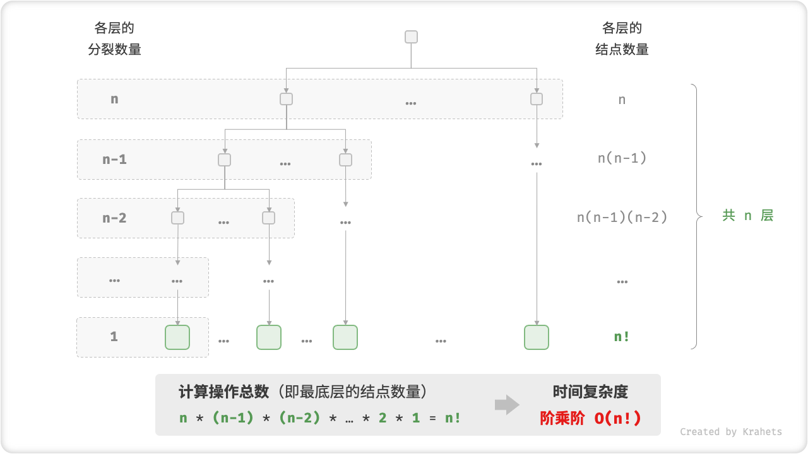

# Time Complexity

## Evaluating Algorithm Run Time

The efficiency of an algorithm can be evaluated rigorously by its run time. If we want to **accurately estimate the run time of a piece of code**, what will we do?

1. First, we need to **determine the running platform**, including hardware configuration, programming language, system environment, etc., which will affect the running efficiency of the code.
2. Next, we need to evaluate **the time required for each operation**, for example the addition operation `+` requires 1 ns, the multiplication operation `*` requires 10 ns, and the print operation requires 5 ns, etc.
3. Finally, we need to **count the number of operations** in the code, and add up the execution time of all operations, which will give us the run time of the code.

For example, the piece of code below, the input size is $n$, according to the above method, we can get the run time of the algorithm as $6n + 12$ ns.

$$
1 + 1 + 10 + (1 + 5) \times n = 6n + 12
$$

=== "Java"

    ```java title=""
    // under a certain running platform
    void algorithm(int n) {
        int a = 2;  // 1 ns
        a = a + 1;  // 1 ns
        a = a * 2;  // 10 ns
        // loop n times
        for (int i = 0; i < n; i++) {  // 1 ns , do i++ every loop
            System.out.println(0);     // 5 ns
        }
    }
    ```

=== "C++"

    ```cpp title=""
    // under a certain running platform
    void algorithm(int n) {
        int a = 2;  // 1 ns
        a = a + 1;  // 1 ns
        a = a * 2;  // 10 ns
        // loop n times
        for (int i = 0; i < n; i++) {  // 1 ns , do i++ every loop
            cout << 0 << endl;         // 5 ns
        }
    }
    ```

=== "Python"

    ```python title=""
    # under a certain running platform
    def algorithm(n):
        a = 2      # 1 ns
        a = a + 1  # 1 ns
        a = a * 2  # 10 ns
        # loop n times
        for _ in range(n):  # 1 ns
            print(0)        # 5 ns
    ```

=== "Go"

    ```go title=""
    // under a certain running platform
    func algorithm(n int) {
        a := 2      // 1 ns
        a = a + 1   // 1 ns
        a = a * 2   // 10 ns
        // loop n times
        for i := 0; i < n; i++ {    // 1 ns
            fmt.Println(a)          // 5 ns
        }
    }
    ```

=== "JavaScript"

    ```js title=""
    // under a certain running platform
    function algorithm(n) {
        var a = 2; // 1 ns
        a = a + 1; // 1 ns
        a = a * 2; // 10 ns
        // loop n times
        for(let i = 0; i < n; i++) { // 1 ns , do i++ every loop
            console.log(0); // 5 ns
        }
    }
    ```

=== "TypeScript"

    ```typescript title=""
    // under a certain running platform
    function algorithm(n: number): void {
        var a: number = 2; // 1 ns
        a = a + 1; // 1 ns
        a = a * 2; // 10 ns
        // loop n times
        for(let i = 0; i < n; i++) { // 1 ns , do i++ every loop
            console.log(0); // 5 ns
        }
    }
    ```

=== "C"

    ```c title=""
    // under a certain running platform
    void algorithm(int n) {
        int a = 2;  // 1 ns
        a = a + 1;  // 1 ns
        a = a * 2;  // 10 ns
        // loop n times
        for (int i = 0; i < n; i++) {   // 1 ns , do i++ every loop
            printf("%d", 0);            // 5 ns
        }
    }
    ```

=== "C#"

    ```csharp title=""
    // under a certain running platform
    void algorithm(int n)
    {
        int a = 2;  // 1 ns
        a = a + 1;  // 1 ns
        a = a * 2;  // 10 ns
        // loop n times
        for (int i = 0; i < n; i++)
        {  // 1 ns ，do i++ every loop
            Console.WriteLine(0);     // 5 ns
        }
    }
    ```

=== "Swift"

    ```swift title=""
    // under a certain running platform
    func algorithm(_ n: Int) {
        var a = 2 // 1 ns
        a = a + 1 // 1 ns
        a = a * 2 // 10 ns
        // loop n times
        for _ in 0 ..< n { // 1 ns
            print(0) // 5 ns
        }
    }
    ```

But in fact, **calculating the run time of statistical algorithms is neither reasonable nor practical**. First of all, we don't want our run time estimates to be bound to a particular platform, since algorithms need to run on all kinds of platforms. Secondly, it is difficult for us to know the running time of each operation, which brings great challenges to the estimation process.

## Evaluating the Growth Trend of Run Time

*Time Complexity Analysis* takes a different approach. It does not calculate the running time of the algorithm, but **the growth trend of the running time as the data size increases**.

The concept of “growth trend” is a bit abstract, so let's use an example to understand it. Suppose the input data size is $n$, and three algorithms `A`, `B`, `C` are given.

- Algorithm `A` only has $1$ print operation, and the running time of the algorithm does not increase with the increase of $n$. We denote the time complexity of this algorithm *constant order*.
- Algorithm `B` has $n$ print operations, and the running time of the algorithm increases linearly with the increase of $n$. We denote the time complexity of this algorithm *linear order*.
- Algorithm `C` has $1000000$ print operations, but the running time of this algorithm is not related to the size of $n$. Thus the time complexity of `C` is the same as `A`, still is *constant order*.

=== "Java"

    ```java title=""
    // time complexity of algorithm A: constant order
    void algorithm_A(int n) {
        System.out.println(0);
    }
    // time complexity of algorithm B: linear order
    void algorithm_B(int n) {
        for (int i = 0; i < n; i++) {
            System.out.println(0);
        }
    }
    // time complexity of algorithm C: constant order
    void algorithm_C(int n) {
        for (int i = 0; i < 1000000; i++) {
            System.out.println(0);
        }
    }
    ```

=== "C++"

    ```cpp title=""
    // time complexity of algorithm A: constant order
    void algorithm_A(int n) {
        cout << 0 << endl;
    }
    // time complexity of algorithm B: linear order
    void algorithm_B(int n) {
        for (int i = 0; i < n; i++) {
            cout << 0 << endl;
        }
    }
    // time complexity of algorithm C: constant order
    void algorithm_C(int n) {
        for (int i = 0; i < 1000000; i++) {
            cout << 0 << endl;
        }
    }
    ```

=== "Python"

    ```python title=""
    # time complexity of algorithm A: constant order
    def algorithm_A(n):
        print(0)
    # time complexity of algorithm B: linear order
    def algorithm_B(n):
        for _ in range(n):
            print(0)
    # time complexity of algorithm C: constant order
    def algorithm_C(n):
        for _ in range(1000000):
            print(0)
    ```

=== "Go"

    ```go title=""
    // time complexity of algorithm A: constant order
    func algorithm_A(n int) {
        fmt.Println(0)
    }
    // time complexity of algorithm B: linear order
    func algorithm_B(n int) {
        for i := 0; i < n; i++ {
            fmt.Println(0)
        }
    }
    // time complexity of algorithm C: constant order
    func algorithm_C(n int) {
        for i := 0; i < 1000000; i++ {
            fmt.Println(0)
        }
    }
    ```

=== "JavaScript"

    ```js title=""
    // time complexity of algorithm A: constant order
    function algorithm_A(n) {
        console.log(0);
    }
    // time complexity of algorithm B: linear order
    function algorithm_B(n) {
        for (let i = 0; i < n; i++) {
            console.log(0);
        }
    }
    // time complexity of algorithm C: constant order
    function algorithm_C(n) {
        for (let i = 0; i < 1000000; i++) {
            console.log(0);
        }
    }

    ```

=== "TypeScript"

    ```typescript title=""
    // time complexity of algorithm A: constant order
    function algorithm_A(n: number): void {
        console.log(0);
    }
    // time complexity of algorithm B: linear order
    function algorithm_B(n: number): void {
        for (let i = 0; i < n; i++) {
            console.log(0);
        }
    }
    // time complexity of algorithm C: constant order
    function algorithm_C(n: number): void {
        for (let i = 0; i < 1000000; i++) {
            console.log(0);
        }
    }
    ```

=== "C"

    ```c title=""
    // time complexity of algorithm A: constant order
    void algorithm_A(int n) {
        printf("%d", 0);
    }
    // time complexity of algorithm B: linear order
    void algorithm_B(int n) {
        for (int i = 0; i < n; i++) {
            printf("%d", 0);
        }
    }
    // time complexity of algorithm C: constant order
    void algorithm_C(int n) {
        for (int i = 0; i < 1000000; i++) {
            printf("%d", 0);
        }
    }
    ```

=== "C#"

    ```csharp title=""
    // time complexity of algorithm A: constant order
    void algorithm_A(int n)
    {
        Console.WriteLine(0);
    }
    // time complexity of algorithm B: linear order
    void algorithm_B(int n)
    {
        for (int i = 0; i < n; i++)
        {
            Console.WriteLine(0);
        }
    }
    // time complexity of algorithm C: constant order
    void algorithm_C(int n)
    {
        for (int i = 0; i < 1000000; i++)
        {
            Console.WriteLine(0);
        }
    }
    ```

=== "Swift"

    ```swift title=""
    // time complexity of algorithm A: constant order
    func algorithmA(_ n: Int) {
        print(0)
    }
    // time complexity of algorithm B: linear order
    func algorithmB(_ n: Int) {
        for _ in 0 ..< n {
            print(0)
        }
    }
    // time complexity of algorithm C: constant order
    func algorithmC(_ n: Int) {
        for _ in 0 ..< 1000000 {
            print(0)
        }
    }
    ```



<p align="center"> Fig. 算法 A, B, C 的时间增长趋势 </p>

相比直接统计算法运行时间，时间复杂度分析的做法有什么好处呢？以及有什么不足？

**时间复杂度可以有效评估算法效率**。算法 `B` 运行时间的增长是线性的，在 $n > 1$ 时慢于算法 `A` ，在 $n > 1000000$ 时慢于算法 `C` 。实质上，只要输入数据大小 $n$ 足够大，复杂度为「常数阶」的算法一定优于「线性阶」的算法，这也正是时间增长趋势的含义。

**时间复杂度的推算方法更加简便**。在时间复杂度分析中，我们可以将统计「计算操作的运行时间」简化为统计「计算操作的数量」，这是因为，无论是运行平台还是计算操作类型，都与算法运行时间的增长趋势无关。因而，我们可以简单地将所有计算操作的执行时间统一看作是相同的“单位时间”，这样的简化做法大大降低了估算难度。

**时间复杂度也存在一定的局限性**。比如，虽然算法 `A` 和 `C` 的时间复杂度相同，但是实际的运行时间有非常大的差别。再比如，虽然算法 `B` 比 `C` 的时间复杂度要更高，但在输入数据大小 $n$ 比较小时，算法 `B` 是要明显优于算法 `C` 的。对于以上情况，我们很难仅凭时间复杂度来判定算法效率高低。然而，即使存在这些问题，计算复杂度仍然是评判算法效率的最有效且常用的方法。

## 函数渐近上界

设算法「计算操作数量」为 $T(n)$ ，其是一个关于输入数据大小 $n$ 的函数。例如，以下算法的操作数量为

$$
T(n) = 3 + 2n
$$

=== "Java"

    ```java title=""
    void algorithm(int n) {
        int a = 1;  // +1
        a = a + 1;  // +1
        a = a * 2;  // +1
        // 循环 n 次
        for (int i = 0; i < n; i++) { // +1（每轮都执行 i ++）
            System.out.println(0);    // +1
        }
    }
    ```

=== "C++"

    ```cpp title=""
    void algorithm(int n) {
        int a = 1;  // +1
        a = a + 1;  // +1
        a = a * 2;  // +1
        // 循环 n 次
        for (int i = 0; i < n; i++) { // +1（每轮都执行 i ++）
            cout << 0 << endl;    // +1
        }
    }
    ```

=== "Python"

    ```python title=""
    def algorithm(n):
        a = 1  # +1
        a = a + 1  # +1
        a = a * 2  # +1
        # 循环 n 次
        for i in range(n):  # +1
            print(0)        # +1
    ```

=== "Go"

    ```go title=""
    func algorithm(n int) {
        a := 1      // +1
        a = a + 1   // +1
        a = a * 2   // +1
        // 循环 n 次
        for i := 0; i < n; i++ {   // +1
            fmt.Println(a)         // +1
        }
    }
    ```

=== "JavaScript"

    ```js title=""
    function algorithm(n){
        var a = 1; // +1
        a += 1; // +1
        a *= 2; // +1
        // 循环 n 次
        for(let i = 0; i < n; i++){ // +1（每轮都执行 i ++）
            console.log(0); // +1
        }

    }
    ```

=== "TypeScript"

    ```typescript title=""
    function algorithm(n: number): void{
        var a: number = 1; // +1
        a += 1; // +1
        a *= 2; // +1
        // 循环 n 次
        for(let i = 0; i < n; i++){ // +1（每轮都执行 i ++）
            console.log(0); // +1
        }

    }
    ```

=== "C"

    ```c title=""
    void algorithm(int n) {
        int a = 1;  // +1
        a = a + 1;  // +1
        a = a * 2;  // +1
        // 循环 n 次
        for (int i = 0; i < n; i++) {   // +1（每轮都执行 i ++）
            printf("%d", 0);            // +1
        }
    }  
    ```

=== "C#"

    ```csharp title=""
    void algorithm(int n) {
        int a = 1;  // +1
        a = a + 1;  // +1
        a = a * 2;  // +1
        // 循环 n 次
        for (int i = 0; i < n; i++) { // +1（每轮都执行 i ++）
            Console.WriteLine(0);     // +1
        }
    }
    ```

=== "Swift"

    ```swift title=""
    func algorithm(n: Int) {
        var a = 1 // +1
        a = a + 1 // +1
        a = a * 2 // +1
        // 循环 n 次
        for _ in 0 ..< n { // +1
            print(0) // +1
        }
    }
    ```

$T(n)$ 是个一次函数，说明时间增长趋势是线性的，因此易得时间复杂度是线性阶。

我们将线性阶的时间复杂度记为 $O(n)$ ，这个数学符号被称为「大 $O$ 记号 Big-$O$ Notation」，代表函数 $T(n)$ 的「渐近上界 asymptotic upper bound」。

我们要推算时间复杂度，本质上是在计算「操作数量函数 $T(n)$ 」的渐近上界。下面我们先来看看函数渐近上界的数学定义。

!!! abstract "函数渐近上界"

    若存在正实数 $c$ 和实数 $n_0$ ，使得对于所有的 $n > n_0$ ，均有
    $$
    T(n) \leq c \cdot f(n)
    $$
    则可认为 $f(n)$ 给出了 $T(n)$ 的一个渐近上界，记为
    $$
    T(n) = O(f(n))
    $$



<p align="center"> Fig. 函数的渐近上界 </p>

本质上看，计算渐近上界就是在找一个函数 $f(n)$ ，**使得在 $n$ 趋向于无穷大时，$T(n)$ 和 $f(n)$ 处于相同的增长级别（仅相差一个常数项 $c$ 的倍数）**。

!!! tip

    渐近上界的数学味儿有点重，如果你感觉没有完全理解，无需担心，因为在实际使用中我们只需要会推算即可，数学意义可以慢慢领悟。

## 推算方法

推算出 $f(n)$ 后，我们就得到时间复杂度 $O(f(n))$ 。那么，如何来确定渐近上界 $f(n)$ 呢？总体分为两步，首先「统计操作数量」，然后「判断渐近上界」。

### 1. 统计操作数量

对着代码，从上到下一行一行地计数即可。然而，**由于上述 $c \cdot f(n)$ 中的常数项 $c$ 可以取任意大小，因此操作数量 $T(n)$ 中的各种系数、常数项都可以被忽略**。根据此原则，可以总结出以下计数偷懒技巧：

1. **跳过数量与 $n$ 无关的操作**。因为他们都是 $T(n)$ 中的常数项，对时间复杂度不产生影响。
2. **省略所有系数**。例如，循环 $2n$ 次、$5n + 1$ 次、……，都可以化简记为 $n$ 次，因为 $n$ 前面的系数对时间复杂度也不产生影响。
3. **循环嵌套时使用乘法**。总操作数量等于外层循环和内层循环操作数量之积，每一层循环依然可以分别套用上述 `1.` 和 `2.` 技巧。

根据以下示例，使用上述技巧前、后的统计结果分别为

$$
\begin{aligned}
T(n) & = 2n(n + 1) + (5n + 1) + 2 & \text{完整统计 (-.-|||)} \newline
& = 2n^2 + 7n + 3 \newline
T(n) & = n^2 + n & \text{偷懒统计 (o.O)}
\end{aligned}
$$

最终，两者都能推出相同的时间复杂度结果，即 $O(n^2)$ 。

=== "Java"

    ```java title=""
    void algorithm(int n) {
        int a = 1;  // +0（技巧 1）
        a = a + n;  // +0（技巧 1）
        // +n（技巧 2）
        for (int i = 0; i < 5 * n + 1; i++) {
            System.out.println(0);
        }
        // +n*n（技巧 3）
        for (int i = 0; i < 2 * n; i++) {
            for (int j = 0; j < n + 1; j++) {
                System.out.println(0);
            }
        }
    }
    ```

=== "C++"

    ```cpp title=""
    void algorithm(int n) {
        int a = 1;  // +0（技巧 1）
        a = a + n;  // +0（技巧 1）
        // +n（技巧 2）
        for (int i = 0; i < 5 * n + 1; i++) {
            cout << 0 << endl;
        }
        // +n*n（技巧 3）
        for (int i = 0; i < 2 * n; i++) {
            for (int j = 0; j < n + 1; j++) {
                cout << 0 << endl;
            }
        }
    }
    ```

=== "Python"

    ```python title=""
    def algorithm(n):
        a = 1      # +0（技巧 1）
        a = a + n  # +0（技巧 1）
        # +n（技巧 2）
        for i in range(5 * n + 1):
            print(0)
        # +n*n（技巧 3）
        for i in range(2 * n):
            for j in range(n + 1):
                print(0)
    ```

=== "Go"

    ```go title=""
    func algorithm(n int) {
        a := 1      // +0（技巧 1）
        a = a + n  // +0（技巧 1）
        // +n（技巧 2）
        for i := 0; i < 5 * n + 1; i++ {
            fmt.Println(0)
        }
        // +n*n（技巧 3）
        for i := 0; i < 2 * n; i++ {
            for j := 0; j < n + 1; j++ {
                fmt.Println(0)
            }
        }
    }
    ```

=== "JavaScript"

    ```js title=""
    function algorithm(n) {
        let a = 1;  // +0（技巧 1）
        a = a + n;  // +0（技巧 1）
        // +n（技巧 2）
        for (let i = 0; i < 5 * n + 1; i++) {
            console.log(0);
        }
        // +n*n（技巧 3）
        for (let i = 0; i < 2 * n; i++) {
            for (let j = 0; j < n + 1; j++) {
                console.log(0);
            }
        }
    }
    ```

=== "TypeScript"

    ```typescript title=""
    function algorithm(n: number): void {
        let a = 1;  // +0（技巧 1）
        a = a + n;  // +0（技巧 1）
        // +n（技巧 2）
        for (let i = 0; i < 5 * n + 1; i++) {
            console.log(0);
        }
        // +n*n（技巧 3）
        for (let i = 0; i < 2 * n; i++) {
            for (let j = 0; j < n + 1; j++) {
                console.log(0);
            }
        }
    }
    ```

=== "C"

    ```c title=""
    void algorithm(int n) {
        int a = 1;  // +0（技巧 1）
        a = a + n;  // +0（技巧 1）
        // +n（技巧 2）
        for (int i = 0; i < 5 * n + 1; i++) {
            printf("%d", 0);
        }
        // +n*n（技巧 3）
        for (int i = 0; i < 2 * n; i++) {
            for (int j = 0; j < n + 1; j++) {
                printf("%d", 0);
            }
        }
    }
    ```

=== "C#"

    ```csharp title=""
    void algorithm(int n)
    {
        int a = 1;  // +0（技巧 1）
        a = a + n;  // +0（技巧 1）
        // +n（技巧 2）
        for (int i = 0; i < 5 * n + 1; i++)
        {
            Console.WriteLine(0);
        }
        // +n*n（技巧 3）
        for (int i = 0; i < 2 * n; i++)
        {
            for (int j = 0; j < n + 1; j++)
            {
                Console.WriteLine(0);
            }
        }
    }
    ```

=== "Swift"

    ```swift title=""
    func algorithm(n: Int) {
        var a = 1 // +0（技巧 1）
        a = a + n // +0（技巧 1）
        // +n（技巧 2）
        for _ in 0 ..< (5 * n + 1) {
            print(0)
        }
        // +n*n（技巧 3）
        for _ in 0 ..< (2 * n) {
            for _ in 0 ..< (n + 1) {
                print(0)
            }
        }
    }
    ```

### 2. 判断渐近上界

**时间复杂度由多项式 $T(n)$ 中最高阶的项来决定**。这是因为在 $n$ 趋于无穷大时，最高阶的项将处于主导作用，其它项的影响都可以被忽略。

以下表格给出了一些例子，其中有一些夸张的值，是想要向大家强调 **系数无法撼动阶数** 这一结论。在 $n$ 趋于无穷大时，这些常数都是“浮云”。

<div class="center-table" markdown>

| 操作数量 $T(n)$         | 时间复杂度 $O(f(n))$   |
| ---------------------- | -------------------- |
| $100000$               | $O(1)$               |
| $3n + 2$               | $O(n)$               |
| $2n^2 + 3n + 2$        | $O(n^2)$             |
| $n^3 + 10000n^2$       | $O(n^3)$             |
| $2^n + 10000n^{10000}$ | $O(2^n)$             |

</div>

## 常见类型

设输入数据大小为 $n$ ，常见的时间复杂度类型有（从低到高排列）

$$
\begin{aligned}
O(1) < O(\log n) < O(n) < O(n \log n) < O(n^2) < O(2^n) < O(n!) \newline
\text{常数阶} < \text{对数阶} < \text{线性阶} < \text{线性对数阶} < \text{平方阶} < \text{指数阶} < \text{阶乘阶}
\end{aligned}
$$


<p align="center"> Fig. 时间复杂度的常见类型 </p>

!!! tip

    部分示例代码需要一些前置知识，包括数组、递归算法等。如果遇到看不懂的地方无需担心，可以在学习完后面章节后再来复习，现阶段先聚焦在理解时间复杂度含义和推算方法上。

### 常数阶 $O(1)$

常数阶的操作数量与输入数据大小 $n$ 无关，即不随着 $n$ 的变化而变化。

对于以下算法，无论操作数量 `size` 有多大，只要与数据大小 $n$ 无关，时间复杂度就仍为 $O(1)$ 。

=== "Java"

    ```java title="time_complexity.java"
    /* 常数阶 */
    int constant(int n) {
        int count = 0;
        int size = 100000;
        for (int i = 0; i < size; i++)
            count++;
        return count;
    }
    ```

=== "C++"

    ```cpp title="time_complexity.cpp"
    /* 常数阶 */
    int constant(int n) {
        int count = 0;
        int size = 100000;
        for (int i = 0; i < size; i++)
            count++;
        return count;
    }
    ```

=== "Python"

    ```python title="time_complexity.py"
    """ 常数阶 """
    def constant(n):
        count = 0
        size = 100000
        for _ in range(size):
            count += 1
        return count
    ```

=== "Go"

    ```go title="time_complexity.go"
    /* 常数阶 */
    func constant(n int) int {
        count := 0
        size := 100000
        for i := 0; i < size; i++ {
            count ++
        }
        return count
    }
    ```

=== "JavaScript"

    ```js title="time_complexity.js"
    /* 常数阶 */
    function constant(n) {
        let count = 0;
        const size = 100000;
        for (let i = 0; i < size; i++) count++;
        return count;
    }
    ```

=== "TypeScript"

    ```typescript title="time_complexity.ts"
    /* 常数阶 */
    function constant(n: number): number {
        let count = 0;
        const size = 100000;
        for (let i = 0; i < size; i++) count++;
        return count;
    }
    ```

=== "C"

    ```c title="time_complexity.c"
    /* 常数阶 */
    int constant(int n) {
        int count = 0;
        int size = 100000;
        int i = 0;
        for (int i = 0; i < size; i++) {
            count ++;
        }
        return count;
    }
    ```

=== "C#"

    ```csharp title="time_complexity.cs"
    /* 常数阶 */
    int constant(int n)
    {
        int count = 0;
        int size = 100000;
        for (int i = 0; i < size; i++)
            count++;
        return count;
    }
    ```

=== "Swift"

    ```swift title="time_complexity.swift"
    /* 常数阶 */
    func constant(n: Int) -> Int {
        var count = 0
        let size = 100000
        for _ in 0 ..< size {
            count += 1
        }
        return count
    }
    ```

### 线性阶 $O(n)$

线性阶的操作数量相对输入数据大小成线性级别增长。线性阶常出现于单层循环。

=== "Java"

    ```java title="time_complexity.java"
    /* 线性阶 */
    int linear(int n) {
        int count = 0;
        for (int i = 0; i < n; i++)
            count++;
        return count;
    }
    ```

=== "C++"

    ```cpp title="time_complexity.cpp"
    /* 线性阶 */
    int linear(int n) {
        int count = 0;
        for (int i = 0; i < n; i++)
            count++;
        return count;
    }
    ```

=== "Python"

    ```python title="time_complexity.py"
    """ 线性阶 """
    def linear(n):
        count = 0
        for _ in range(n):
            count += 1
        return count
    ```

=== "Go"

    ```go title="time_complexity.go"
    /* 线性阶 */
    func linear(n int) int {
        count := 0
        for i := 0; i < n; i++ {
            count++
        }
        return count
    }
    ```

=== "JavaScript"

    ```js title="time_complexity.js"
    /* 线性阶 */
    function linear(n) {
        let count = 0;
        for (let i = 0; i < n; i++) count++;
        return count;
    }
    ```

=== "TypeScript"

    ```typescript title="time_complexity.ts"
    /* 线性阶 */
    function linear(n: number): number {
        let count = 0;
        for (let i = 0; i < n; i++) count++;
        return count;
    }
    ```

=== "C"

    ```c title="time_complexity.c"
    /* 线性阶 */
    int linear(int n) {
        int count = 0;
        for (int i = 0; i < n; i++) {
            count ++;
        }
        return count;
    }
    ```

=== "C#"

    ```csharp title="time_complexity.cs"
    /* 线性阶 */
    int linear(int n)
    {
        int count = 0;
        for (int i = 0; i < n; i++)
            count++;
        return count;
    }
    ```

=== "Swift"

    ```swift title="time_complexity.swift"
    /* 线性阶 */
    func linear(n: Int) -> Int {
        var count = 0
        for _ in 0 ..< n {
            count += 1
        }
        return count
    }
    ```

「遍历数组」和「遍历链表」等操作，时间复杂度都为 $O(n)$ ，其中 $n$ 为数组或链表的长度。

!!! tip

    **数据大小 $n$ 是根据输入数据的类型来确定的**。比如，在上述示例中，我们直接将 $n$ 看作输入数据大小；以下遍历数组示例中，数据大小 $n$ 为数组的长度。

=== "Java"

    ```java title="time_complexity.java"
    /* 线性阶（遍历数组） */
    int arrayTraversal(int[] nums) {
        int count = 0;
        // 循环次数与数组长度成正比
        for (int num : nums) {
            count++;
        }
        return count;
    }
    ```

=== "C++"

    ```cpp title="time_complexity.cpp"
    /* 线性阶（遍历数组） */
    int arrayTraversal(vector<int>& nums) {
        int count = 0;
        // 循环次数与数组长度成正比
        for (int num : nums) {
            count++;
        }
        return count;
    }
    ```

=== "Python"

    ```python title="time_complexity.py"
    """ 线性阶（遍历数组）"""
    def array_traversal(nums):
        count = 0
        # 循环次数与数组长度成正比
        for num in nums:
            count += 1
        return count
    ```

=== "Go"

    ```go title="time_complexity.go"
    /* 线性阶（遍历数组） */
    func arrayTraversal(nums []int) int {
        count := 0
        // 循环次数与数组长度成正比
        for range nums {
            count++
        }
        return count
    }
    ```

=== "JavaScript"

    ```js title="time_complexity.js"
    /* 线性阶（遍历数组） */
    function arrayTraversal(nums) {
        let count = 0;
        // 循环次数与数组长度成正比
        for (let i = 0; i < nums.length; i++) {
            count++;
        }
        return count;
    }
    ```

=== "TypeScript"

    ```typescript title="time_complexity.ts"
    /* 线性阶（遍历数组） */
    function arrayTraversal(nums: number[]): number {
        let count = 0;
        // 循环次数与数组长度成正比
        for (let i = 0; i < nums.length; i++) {
            count++;
        }
        return count;
    }
    ```

=== "C"

    ```c title="time_complexity.c"
    /* 线性阶（遍历数组） */
    int arrayTraversal(int *nums, int n) {
        int count = 0;
        // 循环次数与数组长度成正比
        for (int i = 0; i < n; i++) {
            count ++;
        }
        return count;
    }
    ```

=== "C#"

    ```csharp title="time_complexity.cs"
    /* 线性阶（遍历数组） */
    int arrayTraversal(int[] nums)
    {
        int count = 0;
        // 循环次数与数组长度成正比
        foreach(int num in nums)
        {
            count++;
        }
        return count;
    }
    ```

=== "Swift"

    ```swift title="time_complexity.swift"
    /* 线性阶（遍历数组） */
    func arrayTraversal(nums: [Int]) -> Int {
        var count = 0
        // 循环次数与数组长度成正比
        for _ in nums {
            count += 1
        }
        return count
    }
    ```

### 平方阶 $O(n^2)$

平方阶的操作数量相对输入数据大小成平方级别增长。平方阶常出现于嵌套循环，外层循环和内层循环都为 $O(n)$ ，总体为 $O(n^2)$ 。

=== "Java"

    ```java title="time_complexity.java"
    /* 平方阶 */
    int quadratic(int n) {
        int count = 0;
        // 循环次数与数组长度成平方关系
        for (int i = 0; i < n; i++) {
            for (int j = 0; j < n; j++) {
                count++;
            }
        }
        return count;
    }
    ```

=== "C++"

    ```cpp title="time_complexity.cpp"
    /* 平方阶 */
    int quadratic(int n) {
        int count = 0;
        // 循环次数与数组长度成平方关系
        for (int i = 0; i < n; i++) {
            for (int j = 0; j < n; j++) {
                count++;
            }
        }
        return count;
    }
    ```

=== "Python"

    ```python title="time_complexity.py"
    """ 平方阶 """
    def quadratic(n):
        count = 0
        # 循环次数与数组长度成平方关系
        for i in range(n):
            for j in range(n):
                count += 1
        return count
    ```

=== "Go"

    ```go title="time_complexity.go"
    /* 平方阶 */
    func quadratic(n int) int {
        count := 0
        // 循环次数与数组长度成平方关系
        for i := 0; i < n; i++ {
            for j := 0; j < n; j++ {
                count++
            }
        }
        return count
    }
    ```

=== "JavaScript"

    ```js title="time_complexity.js"
    /* 平方阶 */
    function quadratic(n) {
        let count = 0;
        // 循环次数与数组长度成平方关系
        for (let i = 0; i < n; i++) {
            for (let j = 0; j < n; j++) {
                count++;
            }
        }
        return count;
    }
    ```

=== "TypeScript"

    ```typescript title="time_complexity.ts"
    /* 平方阶 */
    function quadratic(n: number): number {
        let count = 0;
        // 循环次数与数组长度成平方关系
        for (let i = 0; i < n; i++) {
            for (let j = 0; j < n; j++) {
                count++;
            }
        }
        return count;
    }
    ```

=== "C"

    ```c title="time_complexity.c"
    /* 平方阶 */
    int quadratic(int n) {
        int count = 0;
        // 循环次数与数组长度成平方关系
        for (int i = 0; i < n; i++) {
            for (int j = 0; j < n; j++) {
                count ++;
            }
        }
        return count;
    }
    ```

=== "C#"

    ```csharp title="time_complexity.cs"
    /* 平方阶 */
    int quadratic(int n)
    {
        int count = 0;
        // 循环次数与数组长度成平方关系
        for (int i = 0; i < n; i++)
        {
            for (int j = 0; j < n; j++)
            {
                count++;
            }
        }
        return count;
    }
    ```

=== "Swift"

    ```swift title="time_complexity.swift"
    /* 平方阶 */
    func quadratic(n: Int) -> Int {
        var count = 0
        // 循环次数与数组长度成平方关系
        for _ in 0 ..< n {
            for _ in 0 ..< n {
                count += 1
            }
        }
        return count
    }
    ```



<p align="center"> Fig. 常数阶、线性阶、平方阶的时间复杂度 </p>

以「冒泡排序」为例，外层循环 $n - 1$ 次，内层循环 $n-1, n-2, \cdots, 2, 1$ 次，平均为 $\frac{n}{2}$ 次，因此时间复杂度为 $O(n^2)$ 。

$$
O((n - 1) \frac{n}{2}) = O(n^2)
$$

=== "Java"

    ```java title="time_complexity.java"
    /* 平方阶（冒泡排序） */
    int bubbleSort(int[] nums) {
        int count = 0;  // 计数器
        // 外循环：待排序元素数量为 n-1, n-2, ..., 1
        for (int i = nums.length - 1; i > 0; i--) {
            // 内循环：冒泡操作
            for (int j = 0; j < i; j++) {
                if (nums[j] > nums[j + 1]) {
                    // 交换 nums[j] 与 nums[j + 1]
                    int tmp = nums[j];
                    nums[j] = nums[j + 1];
                    nums[j + 1] = tmp;
                    count += 3;  // 元素交换包含 3 个单元操作
                }
            }
        }
        return count;
    }
    ```

=== "C++"

    ```cpp title="time_complexity.cpp"
    /* 平方阶（冒泡排序） */
    int bubbleSort(vector<int>& nums) {
        int count = 0;  // 计数器
        // 外循环：待排序元素数量为 n-1, n-2, ..., 1
        for (int i = nums.size() - 1; i > 0; i--) {
            // 内循环：冒泡操作
            for (int j = 0; j < i; j++) {
                if (nums[j] > nums[j + 1]) {
                    // 交换 nums[j] 与 nums[j + 1]
                    int tmp = nums[j];
                    nums[j] = nums[j + 1];
                    nums[j + 1] = tmp;
                    count += 3;  // 元素交换包含 3 个单元操作
                }
            }
        }
        return count;
    }
    ```

=== "Python"

    ```python title="time_complexity.py"
    """ 平方阶（冒泡排序）"""
    def bubble_sort(nums):
        count = 0  # 计数器
        # 外循环：待排序元素数量为 n-1, n-2, ..., 1
        for i in range(len(nums) - 1, 0, -1):
            # 内循环：冒泡操作
            for j in range(i):
                if nums[j] > nums[j + 1]:
                    # 交换 nums[j] 与 nums[j + 1]
                    tmp = nums[j]
                    nums[j] = nums[j + 1]
                    nums[j + 1] = tmp
                    count += 3  # 元素交换包含 3 个单元操作
        return count
    ```

=== "Go"

    ```go title="time_complexity.go"
     /* 平方阶（冒泡排序） */
     func bubbleSort(nums []int) int {
        count := 0 // 计数器
        // 外循环：待排序元素数量为 n-1, n-2, ..., 1
        for i := len(nums) - 1; i > 0; i-- {
            // 内循环：冒泡操作
            for j := 0; j < i; j++ {
                if nums[j] > nums[j+1] {
                    // 交换 nums[j] 与 nums[j + 1]
                    tmp := nums[j]
                    nums[j] = nums[j+1]
                    nums[j+1] = tmp
                    count += 3 // 元素交换包含 3 个单元操作
                }
            }
        }
        return count
    }
    ```

=== "JavaScript"

    ```js title="time_complexity.js"
    /* 平方阶（冒泡排序） */
    function bubbleSort(nums) {
        let count = 0; // 计数器
        // 外循环：待排序元素数量为 n-1, n-2, ..., 1
        for (let i = nums.length - 1; i > 0; i--) {
            // 内循环：冒泡操作
            for (let j = 0; j < i; j++) {
                if (nums[j] > nums[j + 1]) {
                    // 交换 nums[j] 与 nums[j + 1]
                    let tmp = nums[j];
                    nums[j] = nums[j + 1];
                    nums[j + 1] = tmp;
                    count += 3; // 元素交换包含 3 个单元操作
                }
            }
        }
        return count;
    }
    ```

=== "TypeScript"

    ```typescript title="time_complexity.ts"
    /* 平方阶（冒泡排序） */
    function bubbleSort(nums: number[]): number {
        let count = 0; // 计数器
        // 外循环：待排序元素数量为 n-1, n-2, ..., 1
        for (let i = nums.length - 1; i > 0; i--) {
            // 内循环：冒泡操作
            for (let j = 0; j < i; j++) {
                if (nums[j] > nums[j + 1]) {
                    // 交换 nums[j] 与 nums[j + 1]
                    let tmp = nums[j];
                    nums[j] = nums[j + 1];
                    nums[j + 1] = tmp;
                    count += 3; // 元素交换包含 3 个单元操作
                }
            }
        }
        return count;
    }
    ```

=== "C"

    ```c title="time_complexity.c"
    /* 平方阶（冒泡排序） */
    int bubbleSort(int *nums, int n) {
        int count = 0;  // 计数器 
        // 外循环：待排序元素数量为 n-1, n-2, ..., 1
        for (int i = n - 1; i > 0; i--) {
            // 内循环：冒泡操作
            for (int j = 0; j < i; j++) {
                // 交换 nums[j] 与 nums[j + 1]
                int tmp = nums[j];
                nums[j] = nums[j + 1];
                nums[j + 1] = tmp;
                count += 3;  // 元素交换包含 3 个单元操作
            }
            
        }
        return count;
    }
    ```

=== "C#"

    ```csharp title="time_complexity.cs"
    /* 平方阶（冒泡排序） */
    int bubbleSort(int[] nums)
    {
        int count = 0;  // 计数器
                        // 外循环：待排序元素数量为 n-1, n-2, ..., 1
        for (int i = nums.Length - 1; i > 0; i--)
        {
            // 内循环：冒泡操作
            for (int j = 0; j < i; j++)
            {
                if (nums[j] > nums[j + 1])
                {
                    // 交换 nums[j] 与 nums[j + 1]
                    int tmp = nums[j];
                    nums[j] = nums[j + 1];
                    nums[j + 1] = tmp;
                    count += 3;  // 元素交换包含 3 个单元操作
                }
            }
        }
        return count;
    }

    ```

=== "Swift"

    ```swift title="time_complexity.swift"
    /* 平方阶（冒泡排序） */
    func bubbleSort(nums: inout [Int]) -> Int {
        var count = 0 // 计数器
        // 外循环：待排序元素数量为 n-1, n-2, ..., 1
        for i in sequence(first: nums.count - 1, next: { $0 > 0 + 1 ? $0 - 1 : nil }) {
            // 内循环：冒泡操作
            for j in 0 ..< i {
                if nums[j] > nums[j + 1] {
                    // 交换 nums[j] 与 nums[j + 1]
                    let tmp = nums[j]
                    nums[j] = nums[j + 1]
                    nums[j + 1] = tmp
                    count += 3 // 元素交换包含 3 个单元操作
                }
            }
        }
        return count
    }
    ```

### 指数阶 $O(2^n)$

!!! note

    生物学科中的“细胞分裂”即是指数阶增长：初始状态为 $1$ 个细胞，分裂一轮后为 $2$ 个，分裂两轮后为 $4$ 个，……，分裂 $n$ 轮后有 $2^n$ 个细胞。

指数阶增长得非常快，在实际应用中一般是不能被接受的。若一个问题使用「暴力枚举」求解的时间复杂度是 $O(2^n)$ ，那么一般都需要使用「动态规划」或「贪心算法」等算法来求解。

=== "Java"

    ```java title="time_complexity.java"
    /* 指数阶（循环实现） */
    int exponential(int n) {
        int count = 0, base = 1;
        // cell 每轮一分为二，形成数列 1, 2, 4, 8, ..., 2^(n-1)
        for (int i = 0; i < n; i++) {
            for (int j = 0; j < base; j++) {
                count++;
            }
            base *= 2;
        }
        // count = 1 + 2 + 4 + 8 + .. + 2^(n-1) = 2^n - 1
        return count;
    }
    ```

=== "C++"

    ```cpp title="time_complexity.cpp"
    /* 指数阶（循环实现） */
    int exponential(int n) {
        int count = 0, base = 1;
        // cell 每轮一分为二，形成数列 1, 2, 4, 8, ..., 2^(n-1)
        for (int i = 0; i < n; i++) {
            for (int j = 0; j < base; j++) {
                count++;
            }
            base *= 2;
        }
        // count = 1 + 2 + 4 + 8 + .. + 2^(n-1) = 2^n - 1
        return count;
    }
    ```

=== "Python"

    ```python title="time_complexity.py"
    """ 指数阶（循环实现）"""
    def exponential(n):
        count, base = 0, 1
        # cell 每轮一分为二，形成数列 1, 2, 4, 8, ..., 2^(n-1)
        for _ in range(n):
            for _ in range(base):
                count += 1
            base *= 2
        # count = 1 + 2 + 4 + 8 + .. + 2^(n-1) = 2^n - 1
        return count
    ```

=== "Go"

    ```go title="time_complexity.go"
    /* 指数阶（循环实现）*/
    func exponential(n int) int {
        count, base := 0, 1
        // cell 每轮一分为二，形成数列 1, 2, 4, 8, ..., 2^(n-1)
        for i := 0; i < n; i++ {
            for j := 0; j < base; j++ {
                count++
            }
            base *= 2
        }
        // count = 1 + 2 + 4 + 8 + .. + 2^(n-1) = 2^n - 1
        return count
    }
    ```

=== "JavaScript"

    ```js title="time_complexity.js"
    /* 指数阶（循环实现） */
    function exponential(n) {
        let count = 0,
            base = 1;
        // cell 每轮一分为二，形成数列 1, 2, 4, 8, ..., 2^(n-1)
        for (let i = 0; i < n; i++) {
            for (let j = 0; j < base; j++) {
                count++;
            }
            base *= 2;
        }
        // count = 1 + 2 + 4 + 8 + .. + 2^(n-1) = 2^n - 1
        return count;
    }

    ```

=== "TypeScript"

    ```typescript title="time_complexity.ts"
    /* 指数阶（循环实现） */
    function exponential(n: number): number {
        let count = 0,
            base = 1;
        // cell 每轮一分为二，形成数列 1, 2, 4, 8, ..., 2^(n-1)
        for (let i = 0; i < n; i++) {
            for (let j = 0; j < base; j++) {
                count++;
            }
            base *= 2;
        }
        // count = 1 + 2 + 4 + 8 + .. + 2^(n-1) = 2^n - 1
        return count;
    }
    ```

=== "C"

    ```c title="time_complexity.c"
    /* 指数阶（循环实现） */
    int exponential(int n) {
        int count = 0;
        int bas = 1;
        // cell 每轮一分为二，形成数列 1, 2, 4, 8, ..., 2^(n-1)
        for (int i = 0; i < n; i++) {
            for (int j = 0; j < bas; j++) {
                count++;
            }
            bas *= 2;
        }
        // count = 1 + 2 + 4 + 8 + .. + 2^(n-1) = 2^n - 1
        return count;
    }
    ```

=== "C#"

    ```csharp title="time_complexity.cs"
    /* 指数阶（循环实现） */
    int exponential(int n)
    {
        int count = 0, bas = 1;
        // cell 每轮一分为二，形成数列 1, 2, 4, 8, ..., 2^(n-1)
        for (int i = 0; i < n; i++)
        {
            for (int j = 0; j < bas; j++)
            {
                count++;
            }
            bas *= 2;
        }
        // count = 1 + 2 + 4 + 8 + .. + 2^(n-1) = 2^n - 1
        return count;
    }
    ```

=== "Swift"

    ```swift title="time_complexity.swift"
    /* 指数阶（循环实现） */
    func exponential(n: Int) -> Int {
        var count = 0
        var base = 1
        // cell 每轮一分为二，形成数列 1, 2, 4, 8, ..., 2^(n-1)
        for _ in 0 ..< n {
            for _ in 0 ..< base {
                count += 1
            }
            base *= 2
        }
        // count = 1 + 2 + 4 + 8 + .. + 2^(n-1) = 2^n - 1
        return count
    }
    ```



<p align="center"> Fig. 指数阶的时间复杂度 </p>

在实际算法中，指数阶常出现于递归函数。例如以下代码，不断地一分为二，分裂 $n$ 次后停止。

=== "Java"

    ```java title="time_complexity.java"
    /* 指数阶（递归实现） */
    int expRecur(int n) {
        if (n == 1) return 1;
        return expRecur(n - 1) + expRecur(n - 1) + 1;
    }
    ```

=== "C++"

    ```cpp title="time_complexity.cpp"
    /* 指数阶（递归实现） */
    int expRecur(int n) {
        if (n == 1) return 1;
        return expRecur(n - 1) + expRecur(n - 1) + 1;
    }
    ```

=== "Python"

    ```python title="time_complexity.py"
    """ 指数阶（递归实现）"""
    def exp_recur(n):
        if n == 1: return 1
        return exp_recur(n - 1) + exp_recur(n - 1) + 1
    ```

=== "Go"

    ```go title="time_complexity.go"
    /* 指数阶（递归实现）*/
    func expRecur(n int) int {
        if n == 1 {
            return 1
        }
        return expRecur(n-1) + expRecur(n-1) + 1
    }
    ```

=== "JavaScript"

    ```js title="time_complexity.js"
    /* 指数阶（递归实现） */
    function expRecur(n) {
        if (n == 1) return 1;
        return expRecur(n - 1) + expRecur(n - 1) + 1;
    }
    ```

=== "TypeScript"

    ```typescript title="time_complexity.ts"
    /* 指数阶（递归实现） */
    function expRecur(n: number): number {
        if (n == 1) return 1;
        return expRecur(n - 1) + expRecur(n - 1) + 1;
    }

    ```

=== "C"

    ```c title="time_complexity.c"
    /* 指数阶（递归实现） */
    int expRecur(int n) {
        if (n == 1) return 1;
        return expRecur(n - 1) + expRecur(n - 1) + 1;
    }
    ```

=== "C#"

    ```csharp title="time_complexity.cs"
    /* 指数阶（递归实现） */
    int expRecur(int n)
    {
        if (n == 1) return 1;
        return expRecur(n - 1) + expRecur(n - 1) + 1;
    }
    ```

=== "Swift"

    ```swift title="time_complexity.swift"
    /* 指数阶（递归实现） */
    func expRecur(n: Int) -> Int {
        if n == 1 {
            return 1
        }
        return expRecur(n: n - 1) + expRecur(n: n - 1) + 1
    }
    ```

### 对数阶 $O(\log n)$

对数阶与指数阶正好相反，后者反映“每轮增加到两倍的情况”，而前者反映“每轮缩减到一半的情况”。对数阶仅次于常数阶，时间增长得很慢，是理想的时间复杂度。

对数阶常出现于「二分查找」和「分治算法」中，体现“一分为多”、“化繁为简”的算法思想。

设输入数据大小为 $n$ ，由于每轮缩减到一半，因此循环次数是 $\log_2 n$ ，即 $2^n$ 的反函数。

=== "Java"

    ```java title="time_complexity.java"
    /* 对数阶（循环实现） */
    int logarithmic(float n) {
        int count = 0;
        while (n > 1) {
            n = n / 2;
            count++;
        }
        return count;
    }
    ```

=== "C++"

    ```cpp title="time_complexity.cpp"
    /* 对数阶（循环实现） */
    int logarithmic(float n) {
        int count = 0;
        while (n > 1) {
            n = n / 2;
            count++;
        }
        return count;
    }
    ```

=== "Python"

    ```python title="time_complexity.py"
    """ 对数阶（循环实现）"""
    def logarithmic(n):
        count = 0
        while n > 1:
            n = n / 2
            count += 1
        return count
    ```

=== "Go"

    ```go title="time_complexity.go"
    /* 对数阶（循环实现）*/
    func logarithmic(n float64) int {
        count := 0
        for n > 1 {
            n = n / 2
            count++
        }
        return count
    }
    ```

=== "JavaScript"

    ```js title="time_complexity.js"
    /* 对数阶（循环实现） */
    function logarithmic(n) {
        let count = 0;
        while (n > 1) {
            n = n / 2;
            count++;
        }
        return count;
    }
    ```

=== "TypeScript"

    ```typescript title="time_complexity.ts"
    /* 对数阶（循环实现） */
    function logarithmic(n: number): number {
        let count = 0;
        while (n > 1) {
            n = n / 2;
            count++;
        }
        return count;
    }
    ```

=== "C"

    ```c title="time_complexity.c"
    /* 对数阶（循环实现） */
    int logarithmic(float n) {
        int count = 0;
        while (n > 1) {
            n = n / 2;
            count++;
        }
        return count;
    }
    ```

=== "C#"

    ```csharp title="time_complexity.cs"
    /* 对数阶（循环实现） */
    int logarithmic(float n)
    {
        int count = 0;
        while (n > 1)
        {
            n = n / 2;
            count++;
        }
        return count;
    }
    ```

=== "Swift"

    ```swift title="time_complexity.swift"
    /* 对数阶（循环实现） */
    func logarithmic(n: Int) -> Int {
        var count = 0
        var n = n
        while n > 1 {
            n = n / 2
            count += 1
        }
        return count
    }
    ```



<p align="center"> Fig. 对数阶的时间复杂度 </p>

与指数阶类似，对数阶也常出现于递归函数。以下代码形成了一个高度为 $\log_2 n$ 的递归树。

=== "Java"

    ```java title="time_complexity.java"
    /* 对数阶（递归实现） */
    int logRecur(float n) {
        if (n <= 1) return 0;
        return logRecur(n / 2) + 1;
    }
    ```

=== "C++"

    ```cpp title="time_complexity.cpp"
    /* 对数阶（递归实现） */
    int logRecur(float n) {
        if (n <= 1) return 0;
        return logRecur(n / 2) + 1;
    }
    ```

=== "Python"

    ```python title="time_complexity.py"
    """ 对数阶（递归实现）"""
    def log_recur(n):
        if n <= 1: return 0
        return log_recur(n / 2) + 1
    ```

=== "Go"

    ```go title="time_complexity.go"
    /* 对数阶（递归实现）*/
    func logRecur(n float64) int {
        if n <= 1 {
            return 0
        }
        return logRecur(n/2) + 1
    }
    ```

=== "JavaScript"

    ```js title="time_complexity.js"
    /* 对数阶（递归实现） */
    function logRecur(n) {
        if (n <= 1) return 0;
        return logRecur(n / 2) + 1;
    }
    ```

=== "TypeScript"

    ```typescript title="time_complexity.ts"
    /* 对数阶（递归实现） */
    function logRecur(n: number): number {
        if (n <= 1) return 0;
        return logRecur(n / 2) + 1;
    }
    ```

=== "C"

    ```c title="time_complexity.c"
    /* 对数阶（递归实现） */
    int logRecur(float n) {
        if (n <= 1) return 0;
        return logRecur(n / 2) + 1;
    }
    ```

=== "C#"

    ```csharp title="time_complexity.cs"
    /* 对数阶（递归实现） */
    int logRecur(float n)
    {
        if (n <= 1) return 0;
        return logRecur(n / 2) + 1;
    }
    ```

=== "Swift"

    ```swift title="time_complexity.swift"
    /* 对数阶（递归实现） */
    func logRecur(n: Int) -> Int {
        if n <= 1 {
            return 0
        }
        return logRecur(n: n / 2) + 1
    }
    ```

### 线性对数阶 $O(n \log n)$

线性对数阶常出现于嵌套循环中，两层循环的时间复杂度分别为 $O(\log n)$ 和 $O(n)$ 。

主流排序算法的时间复杂度都是 $O(n \log n )$ ，例如快速排序、归并排序、堆排序等。

=== "Java"

    ```java title="time_complexity.java"
    /* 线性对数阶 */
    int linearLogRecur(float n) {
        if (n <= 1) return 1;
        int count = linearLogRecur(n / 2) +
                    linearLogRecur(n / 2);
        for (int i = 0; i < n; i++) {
            count++;
        }
        return count;
    }
    ```

=== "C++"

    ```cpp title="time_complexity.cpp"
    /* 线性对数阶 */
    int linearLogRecur(float n) {
        if (n <= 1) return 1;
        int count = linearLogRecur(n / 2) +
                    linearLogRecur(n / 2);
        for (int i = 0; i < n; i++) {
            count++;
        }
        return count;
    }
    ```

=== "Python"

    ```python title="time_complexity.py"
    """ 线性对数阶 """
    def linear_log_recur(n):
        if n <= 1: return 1
        count = linear_log_recur(n // 2) + \
                linear_log_recur(n // 2)
        for _ in range(n):
            count += 1
        return count
    ```

=== "Go"

    ```go title="time_complexity.go"
    /* 线性对数阶 */
    func linearLogRecur(n float64) int {
        if n <= 1 {
            return 1
        }
        count := linearLogRecur(n/2) +
            linearLogRecur(n/2)
        for i := 0.0; i < n; i++ {
            count++
        }
        return count
    }
    ```

=== "JavaScript"

    ```js title="time_complexity.js"
    /* 线性对数阶 */
    function linearLogRecur(n) {
        if (n <= 1) return 1;
        let count = linearLogRecur(n / 2) + linearLogRecur(n / 2);
        for (let i = 0; i < n; i++) {
            count++;
        }
        return count;
    }
    ```

=== "TypeScript"

    ```typescript title="time_complexity.ts"
    /* 线性对数阶 */
    function linearLogRecur(n: number): number {
        if (n <= 1) return 1;
        let count = linearLogRecur(n / 2) + linearLogRecur(n / 2);
        for (let i = 0; i < n; i++) {
            count++;
        }
        return count;
    }
    ```

=== "C"

    ```c title="time_complexity.c"
    /* 线性对数阶 */
    int linearLogRecur(float n) {
        if (n <= 1) return 1;
        int count = linearLogRecur(n / 2) +
                    linearLogRecur(n / 2);
        for (int i = 0; i < n; i++) {
            count ++;
        }
        return count;
    }
    ```

=== "C#"

    ```csharp title="time_complexity.cs"
    /* 线性对数阶 */
    int linearLogRecur(float n)
    {
        if (n <= 1) return 1;
        int count = linearLogRecur(n / 2) +
                    linearLogRecur(n / 2);
        for (int i = 0; i < n; i++)
        {
            count++;
        }
        return count;
    }
    ```

=== "Swift"

    ```swift title="time_complexity.swift"
    /* 线性对数阶 */
    func linearLogRecur(n: Double) -> Int {
        if n <= 1 {
            return 1
        }
        var count = linearLogRecur(n: n / 2) + linearLogRecur(n: n / 2)
        for _ in 0 ..< Int(n) {
            count += 1
        }
        return count
    }
    ```



<p align="center"> Fig. 线性对数阶的时间复杂度 </p>

### 阶乘阶 $O(n!)$

阶乘阶对应数学上的「全排列」。即给定 $n$ 个互不重复的元素，求其所有可能的排列方案，则方案数量为

$$
n! = n \times (n - 1) \times (n - 2) \times \cdots \times 2 \times 1
$$

阶乘常使用递归实现。例如以下代码，第一层分裂出 $n$ 个，第二层分裂出 $n - 1$ 个，…… ，直至到第 $n$ 层时终止分裂。

=== "Java"

    ```java title="time_complexity.java"
    /* 阶乘阶（递归实现） */
    int factorialRecur(int n) {
        if (n == 0) return 1;
        int count = 0;
        // 从 1 个分裂出 n 个
        for (int i = 0; i < n; i++) {
            count += factorialRecur(n - 1);
        }
        return count;
    }
    ```

=== "C++"

    ```cpp title="time_complexity.cpp"
    /* 阶乘阶（递归实现） */
    int factorialRecur(int n) {
        if (n == 0) return 1;
        int count = 0;
        // 从 1 个分裂出 n 个
        for (int i = 0; i < n; i++) {
            count += factorialRecur(n - 1);
        }
        return count;
    }
    ```

=== "Python"

    ```python title="time_complexity.py"
    """ 阶乘阶（递归实现）"""
    def factorial_recur(n):
        if n == 0: return 1
        count = 0
        # 从 1 个分裂出 n 个
        for _ in range(n):
            count += factorial_recur(n - 1)
        return count
    ```

=== "Go"

    ```go title="time_complexity.go"
    /* 阶乘阶（递归实现） */
    func factorialRecur(n int) int {
        if n == 0 {
            return 1
        }
        count := 0
        // 从 1 个分裂出 n 个
        for i := 0; i < n; i++ {
            count += factorialRecur(n - 1)
        }
        return count
    }
    ```

=== "JavaScript"

    ```js title="time_complexity.js"
    /* 阶乘阶（递归实现） */
    function factorialRecur(n) {
        if (n == 0) return 1;
        let count = 0;
        // 从 1 个分裂出 n 个
        for (let i = 0; i < n; i++) {
            count += factorialRecur(n - 1);
        }
        return count;
    }
    ```

=== "TypeScript"

    ```typescript title="time_complexity.ts"
    /* 阶乘阶（递归实现） */
    function factorialRecur(n: number): number {
        if (n == 0) return 1;
        let count = 0;
        // 从 1 个分裂出 n 个
        for (let i = 0; i < n; i++) {
            count += factorialRecur(n - 1);
        }
        return count;
    }
    ```

=== "C"

    ```c title="time_complexity.c"
    /* 阶乘阶（递归实现） */
    int factorialRecur(int n) {
        if (n == 0) return 1;
        int count = 0;
        for (int i = 0; i < n; i++) {
            count += factorialRecur(n - 1);
        }
        return count;
    }
    ```

=== "C#"

    ```csharp title="time_complexity.cs"
    /* 阶乘阶（递归实现） */
    int factorialRecur(int n)
    {
        if (n == 0) return 1;
        int count = 0;
        // 从 1 个分裂出 n 个
        for (int i = 0; i < n; i++)
        {
            count += factorialRecur(n - 1);
        }
        return count;
    }
    ```

=== "Swift"

    ```swift title="time_complexity.swift"
    /* 阶乘阶（递归实现） */
    func factorialRecur(n: Int) -> Int {
        if n == 0 {
            return 1
        }
        var count = 0
        // 从 1 个分裂出 n 个
        for _ in 0 ..< n {
            count += factorialRecur(n: n - 1)
        }
        return count
    }
    ```



<p align="center"> Fig. 阶乘阶的时间复杂度 </p>

## 最差、最佳、平均时间复杂度

**某些算法的时间复杂度不是恒定的，而是与输入数据的分布有关**。举一个例子，输入一个长度为 $n$ 数组 `nums` ，其中 `nums` 由从 $1$ 至 $n$ 的数字组成，但元素顺序是随机打乱的；算法的任务是返回元素 $1$ 的索引。我们可以得出以下结论：

- 当 `nums = [?, ?, ..., 1]`，即当末尾元素是 $1$ 时，则需完整遍历数组，此时达到 **最差时间复杂度 $O(n)$** ；
- 当 `nums = [1, ?, ?, ...]` ，即当首个数字为 $1$ 时，无论数组多长都不需要继续遍历，此时达到 **最佳时间复杂度 $\Omega(1)$** ；

「函数渐近上界」使用大 $O$ 记号表示，代表「最差时间复杂度」。与之对应，「函数渐近下界」用 $\Omega$ 记号（Omega Notation）来表示，代表「最佳时间复杂度」。

=== "Java"

    ```java title="worst_best_time_complexity.java"
    public class worst_best_time_complexity {
        /* 生成一个数组，元素为 { 1, 2, ..., n }，顺序被打乱 */
        int[] randomNumbers(int n) {
            Integer[] nums = new Integer[n];
            // 生成数组 nums = { 1, 2, 3, ..., n }
            for (int i = 0; i < n; i++) {
                nums[i] = i + 1;
            }
            // 随机打乱数组元素
            Collections.shuffle(Arrays.asList(nums));
            // Integer[] -> int[]
            int[] res = new int[n];
            for (int i = 0; i < n; i++) {
                res[i] = nums[i];
            }
            return res;
        }

        /* 查找数组 nums 中数字 1 所在索引 */
        int findOne(int[] nums) {
            for (int i = 0; i < nums.length; i++) {
                if (nums[i] == 1)
                    return i;
            }
            return -1;
        }

        /* Driver Code */
        public void main(String[] args) {
            for (int i = 0; i < 10; i++) {
                int n = 100;
                int[] nums = randomNumbers(n);
                int index = findOne(nums);
                System.out.println("打乱后的数组为 " + Arrays.toString(nums));
                System.out.println("数字 1 的索引为 " + index);
            }
        }
    }
    ```

=== "C++"

    ```cpp title="worst_best_time_complexity.cpp"
    /* 生成一个数组，元素为 { 1, 2, ..., n }，顺序被打乱 */
    vector<int> randomNumbers(int n) {
        vector<int> nums(n);
        // 生成数组 nums = { 1, 2, 3, ..., n }
        for (int i = 0; i < n; i++) {
            nums[i] = i + 1;
        }
        // 使用系统时间生成随机种子
        unsigned seed = chrono::system_clock::now().time_since_epoch().count();
        // 随机打乱数组元素
        shuffle(nums.begin(), nums.end(), default_random_engine(seed));
        return nums;
    }

    /* 查找数组 nums 中数字 1 所在索引 */
    int findOne(vector<int>& nums) {
        for (int i = 0; i < nums.size(); i++) {
            if (nums[i] == 1)
                return i;
        }
        return -1;
    }


    /* Driver Code */
    int main() {
        for (int i = 0; i < 1000; i++) {
            int n = 100;
            vector<int> nums = randomNumbers(n);
            int index = findOne(nums);
            cout << "\n数组 [ 1, 2, ..., n ] 被打乱后 = ";
            PrintUtil::printVector(nums);
            cout << "数字 1 的索引为 " << index << endl;
        }
        return 0;
    }
    ```

=== "Python"

    ```python title="worst_best_time_complexity.py"
    """ 生成一个数组，元素为: 1, 2, ..., n ，顺序被打乱 """
    def random_numbers(n):
        # 生成数组 nums =: 1, 2, 3, ..., n
        nums = [i for i in range(1, n + 1)]
        # 随机打乱数组元素
        random.shuffle(nums)
        return nums

    """ 查找数组 nums 中数字 1 所在索引 """
    def find_one(nums):
        for i in range(len(nums)):
            if nums[i] == 1:
                return i
        return -1

    """ Driver Code """
    if __name__ == "__main__":
        for i in range(10):
            n = 100
            nums = random_numbers(n)
            index = find_one(nums)
            print("\n数组 [ 1, 2, ..., n ] 被打乱后 =", nums)
            print("数字 1 的索引为", index)
    ```

=== "Go"

    ```go title="worst_best_time_complexity.go"
    /* 生成一个数组，元素为 { 1, 2, ..., n }，顺序被打乱 */
    func randomNumbers(n int) []int {
        nums := make([]int, n)
        // 生成数组 nums = { 1, 2, 3, ..., n }
        for i := 0; i < n; i++ {
            nums[i] = i + 1
        }
        // 随机打乱数组元素
        rand.Shuffle(len(nums), func(i, j int) {
            nums[i], nums[j] = nums[j], nums[i]
        })
        return nums
    }

    /* 查找数组 nums 中数字 1 所在索引 */
    func findOne(nums []int) int {
        for i := 0; i < len(nums); i++ {
            if nums[i] == 1 {
                return i
            }
        }
        return -1
    }

    /* Driver Code */
    func main() {
        for i := 0; i < 10; i++ {
            n := 100
            nums := randomNumbers(n)
            index := findOne(nums)
            fmt.Println("\n数组 [ 1, 2, ..., n ] 被打乱后 =", nums)
            fmt.Println("数字 1 的索引为", index)
        }
    }
    ```

=== "JavaScript"

    ```js title="worst_best_time_complexity.js"
    /* 生成一个数组，元素为 { 1, 2, ..., n }，顺序被打乱 */
    function randomNumbers(n) {
        let nums = Array(n);
        // 生成数组 nums = { 1, 2, 3, ..., n }
        for (let i = 0; i < n; i++) {
            nums[i] = i + 1;
        }
        // 随机打乱数组元素
        for (let i = 0; i < n; i++) {
            let r = Math.floor(Math.random() * (i + 1));
            let temp = nums[i];
            nums[i] = nums[r];
            nums[r] = temp;
        }
        return nums;
    }

    /* 查找数组 nums 中数字 1 所在索引 */
    function findOne(nums) {
        for (let i = 0; i < nums.length; i++) {
            if (nums[i] === 1) {
                return i;
            }
        }
        return -1;
    }

    /* Driver Code */
    function main() {
        for (let i = 0; i < 10; i++) {
            let n = 100;
            let nums = randomNumbers(n);
            let index = findOne(nums);
            console.log(
                "\n数组 [ 1, 2, ..., n ] 被打乱后 = [" + nums.join(", ") + "]"
            );
            console.log("数字 1 的索引为 " + index);
        }
    }
    ```

=== "TypeScript"

    ```typescript title="worst_best_time_complexity.ts"
    /* 生成一个数组，元素为 { 1, 2, ..., n }，顺序被打乱 */
    function randomNumbers(n: number): number[] {
        let nums = Array(n);
        // 生成数组 nums = { 1, 2, 3, ..., n }
        for (let i = 0; i < n; i++) {
            nums[i] = i + 1;
        }
        // 随机打乱数组元素
        for (let i = 0; i < n; i++) {
            let r = Math.floor(Math.random() * (i + 1));
            let temp = nums[i];
            nums[i] = nums[r];
            nums[r] = temp;
        }
        return nums;
    }

    /* 查找数组 nums 中数字 1 所在索引 */
    function findOne(nums: number[]): number {
        for (let i = 0; i < nums.length; i++) {
            if (nums[i] === 1) {
                return i;
            }
        }
        return -1;
    }

    /* Driver Code */
    function main(): void {
        for (let i = 0; i < 10; i++) {
            let n = 100;
            let nums = randomNumbers(n);
            let index = findOne(nums);
            console.log(
                "\n数组 [ 1, 2, ..., n ] 被打乱后 = [" + nums.join(", ") + "]"
            );
            console.log("数字 1 的索引为 " + index);
        }
    }
    ```

=== "C"

    ```c title="worst_best_time_complexity.c"
    /* 生成一个数组，元素为 { 1, 2, ..., n }，顺序被打乱 */
    int *randomNumbers(int n) {
        // 分配堆区内存（创建一维可变长数组：数组中元素数量为n，元素类型为int）
        int *nums = (int *)malloc(n * sizeof(int));
        // 生成数组 nums = { 1, 2, 3, ..., n }
        for (int i = 0; i < n; i++) {
            nums[i] = i + 1;
        }
        // 随机打乱数组元素 
        for (int i = n - 1; i > 0; i--) {
            int j = rand() % (i + 1);
            int temp = nums[i];
            nums[i] = nums[j];
            nums[j] = temp; 
        }
        return nums;
    }

    /* 查找数组 nums 中数字 1 所在索引 */
    int findOne(int *nums, int n) {
        for (int i = 0; i < n; i++) {
            if (nums[i] == 1) return i;
        }
        return -1;
    }

    /* Driver Code */
    int main(int argc, char *argv[]) {
        // 初始化随机数种子
        srand((unsigned int)time(NULL));
        for (int i = 0; i < 10; i++) {
            int n = 100;
            int *nums = randomNumbers(n);
            int index = findOne(nums, n);
            printf("\n数组 [ 1, 2, ..., n ] 被打乱后 = ");
            printArray(nums, n);
            printf("数字 1 的索引为 %d\n", index);
            // 释放堆区内存
            if (nums != NULL) {
                free(nums);
                nums = NULL;
            }
        }
        getchar();
        return 0;
    }
    ```

=== "C#"

    ```csharp title="worst_best_time_complexity.cs"
    /* 生成一个数组，元素为 { 1, 2, ..., n }，顺序被打乱 */
    int[] randomNumbers(int n)
    {
        int[] nums = new int[n];
        // 生成数组 nums = { 1, 2, 3, ..., n }
        for (int i = 0; i < n; i++)
        {
            nums[i] = i + 1;
        }

        // 随机打乱数组元素
        for (int i = 0; i < nums.Length; i++)
        {
            var index = new Random().Next(i, nums.Length);
            var tmp = nums[i];
            var ran = nums[index];
            nums[i] = ran;
            nums[index] = tmp;
        }
        return nums;
    }

    /* 查找数组 nums 中数字 1 所在索引 */
    int findOne(int[] nums)
    {
        for (int i = 0; i < nums.Length; i++)
        {
            if (nums[i] == 1)
                return i;
        }
        return -1;
    }

    /* Driver Code */
    public void main(String[] args)
    {
        for (int i = 0; i < 10; i++)
        {
            int n = 100;
            int[] nums = randomNumbers(n);
            int index = findOne(nums);
            Console.WriteLine("\n数组 [ 1, 2, ..., n ] 被打乱后 = " + string.Join(",", nums));
            Console.WriteLine("数字 1 的索引为 " + index);
        }
    }
    ```

=== "Swift"

    ```swift title="worst_best_time_complexity.swift"
    /* 生成一个数组，元素为 { 1, 2, ..., n }，顺序被打乱 */
    func randomNumbers(n: Int) -> [Int] {
        // 生成数组 nums = { 1, 2, 3, ..., n }
        var nums = Array(1 ... n)
        // 随机打乱数组元素
        nums.shuffle()
        return nums
    }

    /* 查找数组 nums 中数字 1 所在索引 */
    func findOne(nums: [Int]) -> Int {
        for i in nums.indices {
            if nums[i] == 1 {
                return i
            }
        }
        return -1
    }

    /* Driver Code */
    func main() {
        for _ in 0 ..< 10 {
            let n = 100
            let nums = randomNumbers(n: n)
            let index = findOne(nums: nums)
            print("数组 [ 1, 2, ..., n ] 被打乱后 = \(nums)")
            print("数字 1 的索引为 \(index)")
        }
    }
    ```

!!! tip

    我们在实际应用中很少使用「最佳时间复杂度」，因为往往只有很小概率下才能达到，会带来一定的误导性。反之，「最差时间复杂度」最为实用，因为它给出了一个“效率安全值”，让我们可以放心地使用算法。

从上述示例可以看出，最差或最佳时间复杂度只出现在“特殊分布的数据”中，这些情况的出现概率往往很小，因此并不能最真实地反映算法运行效率。**相对地，「平均时间复杂度」可以体现算法在随机输入数据下的运行效率，用 $\Theta$ 记号（Theta Notation）来表示**。

对于部分算法，我们可以简单地推算出随机数据分布下的平均情况。比如上述示例，由于输入数组是被打乱的，因此元素 $1$ 出现在任意索引的概率都是相等的，那么算法的平均循环次数则是数组长度的一半 $\frac{n}{2}$ ，平均时间复杂度为 $\Theta(\frac{n}{2}) = \Theta(n)$ 。

但在实际应用中，尤其是较为复杂的算法，计算平均时间复杂度比较困难，因为很难简便地分析出在数据分布下的整体数学期望。这种情况下，我们一般使用最差时间复杂度来作为算法效率的评判标准。

!!! question "为什么很少看到 $\Theta$ 符号？"

    实际中我们经常使用「大 $O$ 符号」来表示「平均复杂度」，这样严格意义上来说是不规范的。这可能是因为 $O$ 符号实在是太朗朗上口了。</br>如果在本书和其他资料中看到类似 **平均时间复杂度 $O(n)$** 的表述，请你直接理解为 $\Theta(n)$ 即可。
